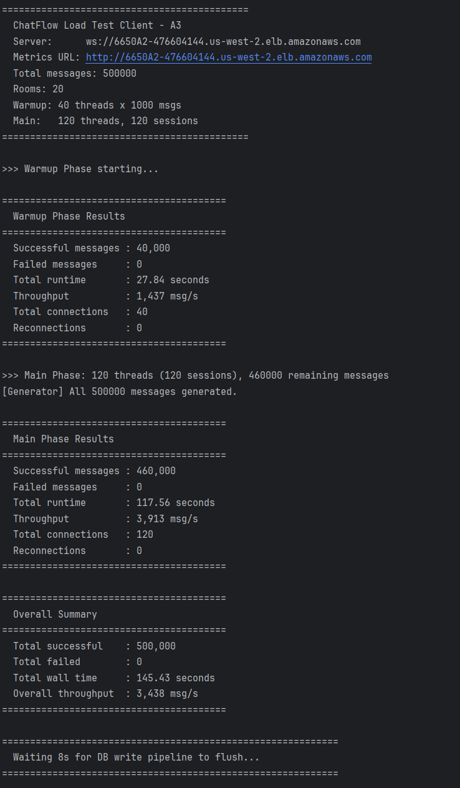
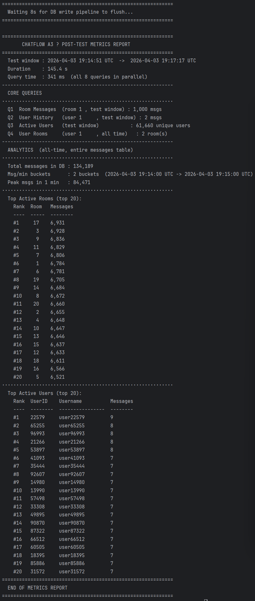
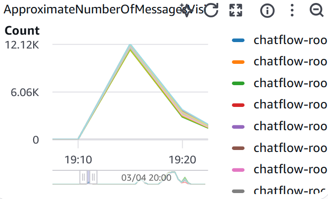
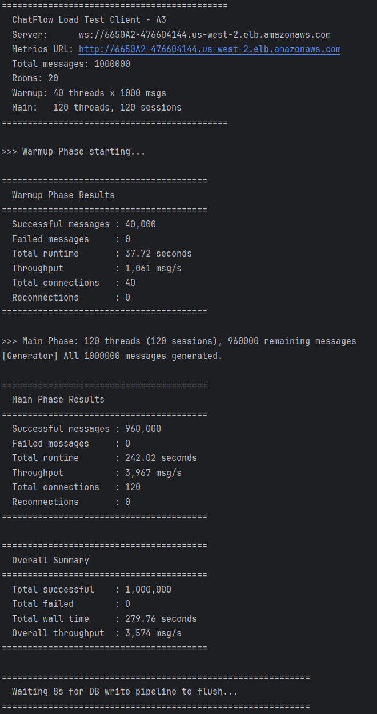
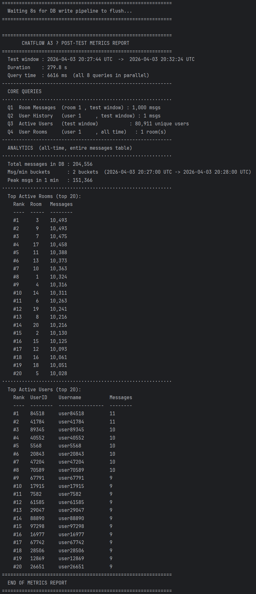
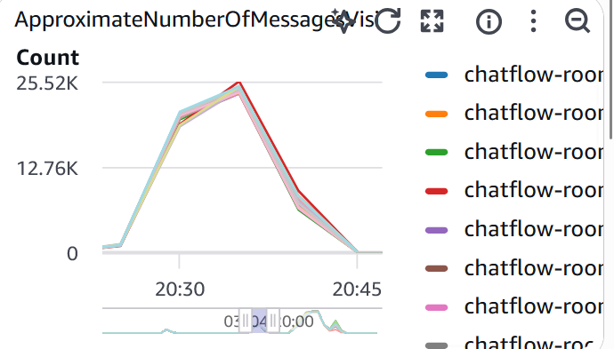
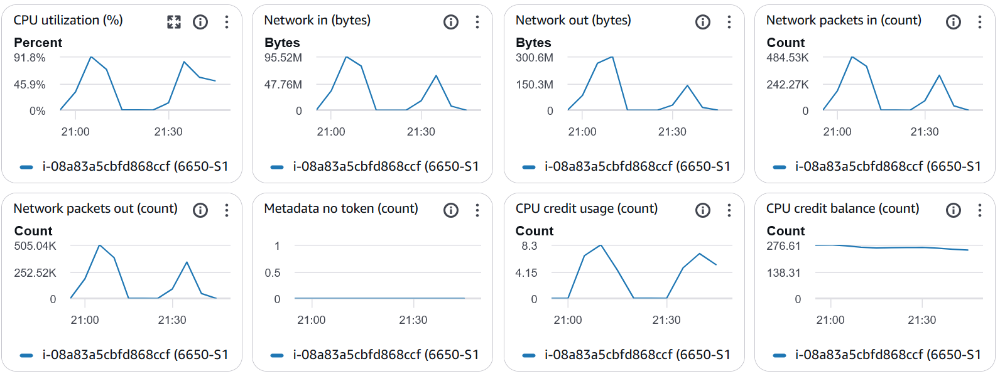

# ChatFlow A3 — Load Test Performance Report

## 1. System Configuration

| Component | Spec | Details |
|-----------|------|---------|
| EC2-Consumer | t3.micro (2 vCPU, 1 GB) | consumer-v3 only; SQS polling + DB writes |
| EC2-S1 | t3.micro (2 vCPU, 1 GB) | server-v3; WebSocket + SQS publish |
| EC2-S2 | t3.micro (2 vCPU, 1 GB) | server-v3; WebSocket + SQS publish |
| RDS | db.t3.micro, PostgreSQL 17, 20 GB gp2 | private VPC, no public access |
| SQS | 20 × FIFO queues | one per chat room, us-west-2 |
| ALB | Internet-facing | sticky session (LB cookie), idle timeout 300s |
| Load client | Local machine | 40 warmup threads × 1,000 msgs + 120 main threads |

**Consumer pipeline config (all tests):**

```
app.db.batch-size=500
app.db.flush-interval-ms=500
app.db.writer-threads=5
app.db.queue-capacity=100000
spring.datasource.hikari.maximum-pool-size=10
```

---

## 2. Batch Size Tuning

Four experiments were run (50,000 messages each, `flush-interval-ms=500` fixed) to find the optimal `app.db.batch-size`.

| Experiment | batch-size | db.inserted | db.batches | db.avgBatchSize | db.avgInsertMs | db.failed |
|------------|-----------|-------------|------------|-----------------|----------------|-----------|
| E1 | 100 | 50,000 | 44,548 | 1.1 | 2.9 ms | 0 |
| E2 | 500 | 50,000 | ~35,000* | 1.1 | 3.2 ms | 0 |
| E3 | 1,000 | 50,000 | 40,967 | 1.2 | 3.5 ms | 0 |
| E4 | 5,000 | 50,000 | 41,762 | 1.2 | 3.4 ms | 0 |

*E2 snapshot taken mid-drain; final inserted = 50,000*

### Key Finding: Batch Size Configuration Has No Effect

`avgBatchSize` is consistently **1.1–1.2** regardless of whether `batch-size` is set to 100 or 5,000. The root cause is the pipeline throughput imbalance:

```
SQS FIFO → Consumer threads → LinkedBlockingQueue → DB Writer threads
              ~1,000 msg/s                              flush every 500ms
```

At ~1,000 msg/s divided across 5 writer threads, each thread receives ~200 messages/s. In a 500ms flush window, only ~100 messages accumulate per thread before the flush timer fires — far below the configured batch sizes (500–5,000). The DB write pipeline drains the queue faster than SQS can fill it.

**Conclusion:** `batch-size=500` was selected as the default. The multi-row `VALUES` INSERT implementation is correct and would activate automatically at sustained ingestion rates above ~5,000 msg/s (e.g., with Standard SQS queues and more consumer threads).

---

## 3. Test 1 — Baseline (500,000 Messages)

### Configuration
- Messages: 500,000
- Batch size: 500 / Flush interval: 500ms / Writer threads: 5

### Results

| Metric | Value |
|--------|-------|
| Total duration | 8 min 15 sec |
| Average throughput | **~1,008 msg/s** |
| db.inserted | **500,000** |
| db.failed | **0** |
| db.avgBatchSize | 1.2 |
| db.avgInsertMs | 3.2 ms |
| db.queueDepth (peak) | 1 (instantaneous, resolved immediately) |
| Duplicate message_ids | 0 |

### Observations

- `db.queueDepth` stayed at 0 for the entire test — DB writes kept pace with SQS consumption at all times
- `avgInsertMs` of 3.2ms represents one RDS network round-trip (EC2 → RDS in same AZ)
- Room distribution was uniform across all 20 rooms (~25,000 messages per room)
- Top user message count was 18 — consistent with random userId selection from 1–100,000

 
 
 

```
--- /health ---
{
"status": "UP",
"timestamp": "2026-04-03T19:23:37.924288589Z",
"sqs": {
"consumed": 500000,
"broadcasts": 500000
},
"db": {
"enqueued": 500000,
"inserted": 500000,
"failed": 0,
"queueDepth": 0,
"batches": 404751,
"avgBatchSize": "1.2",
"avgInsertMs": "3.2"
}
```
---

## 4. Test 2 — Stress Test (1,000,000 Messages)

### Configuration
- Messages: 1,000,000
- Same pipeline config as Test 1
- DB started with 500,000 existing rows from Test 1

### Results

| Metric | Value |
|--------|-------|
| Total duration | 17 min 02 sec |
| Average throughput | **~978 msg/s** |
| db.inserted | **1,000,000** |
| db.failed | **0** |
| db.avgBatchSize | 1.4 |
| db.avgInsertMs | 3.9 ms |
| db.queueDepth (peak) | 2,096 (brief spike, resolved in < 10s) |
| Duplicate message_ids | 0 |

### Observations

**avgInsertMs degraded from 2.7ms (start) → 3.9ms (end):** As the table grew from 500K to 1.5M rows, B-tree index maintenance overhead increased. Each INSERT must update 4 index structures; at larger tree depth the cost per update grows. This is expected behavior for RDS db.t3.micro with 4 indexes on a growing table.

**avgBatchSize improved from 1.1 → 1.4 over the test:** The slight increase correlates with the rising `avgInsertMs` — slower DB inserts cause messages to accumulate slightly more in the queue before each flush, producing marginally larger batches. The effect is small but measurable.

**Brief queue spikes (max 2,096):** Occurred at several points during the test, all self-resolving within one 10-second monitoring interval. These coincide with rows where `avgInsertMs` is elevated (likely minor GC pauses on RDS). No messages were lost.

**Throughput comparison:** 978 msg/s vs 1,008 msg/s in Test 1 — 3% degradation attributable to larger table and higher index maintenance cost, not to the DB write pipeline itself.




```
--- /health ---
{
    "status": "UP",
    "timestamp": "2026-04-03T20:45:07.160258714Z",
    "sqs": {
        "consumed": 1000000,
        "broadcasts": 1000000
    },
    "db": {
        "enqueued": 1000000,
        "inserted": 1000000,
        "failed": 0,
        "queueDepth": 0,
        "batches": 714721,
        "avgBatchSize": "1.4",
        "avgInsertMs": "3.9"
    }
}
```
---

## 5. Test 3 — Endurance Test (1,800,000 Messages / Target 30 min)

### Configuration
- Target: 1,800,000 messages (~30 min at ~1,000 msg/s)
- DB started with 1,500,000 existing rows from Tests 1 and 2

### Result: INCOMPLETE — Server Tier CPU Saturation

Both EC2-S1 and EC2-S2 reached **~90% CPU utilization** and became unable to complete TCP handshakes within BroadcastClient's 200ms connect timeout.

**Timeline:**
1. Test begins; EC2-S1 CPU rises to **91.8%** (all WebSocket connections from ALB sticky session + SQS publish load)
2. Consumer `BroadcastClient` starts receiving `HttpConnectTimeoutException` to EC2-S1 — TCP SYN packets queued in kernel backlog, no SYN-ACK within 200ms
3. Consumer falls back to EC2-S2 (`anySuccess=true`) — DB writes continue uninterrupted
4. EC2-S2 subsequently reaches **~90% CPU** as it absorbs all broadcast traffic alone
5. Both servers become unresponsive; test client WebSocket sessions disconnect



### Critical Observation: DB Pipeline Was Unaffected

The write-behind architecture decouples DB persistence from the broadcast path. Even as both servers became unresponsive:
- `db.failed` remained 0
- `db.queueDepth` stayed near 0
- DB inserts continued at the same rate

This validates the core design decision: DB writes are a parallel path and do not depend on broadcast success.

### Root Cause Analysis

t3.micro provides 2 vCPU with **baseline CPU of 10%** (burstable). Each server EC2 was simultaneously handling:
- ~80 active WebSocket connections (ALB distributes client sessions)
- SQS `sendMessage` async calls (one per incoming message)
- Internal broadcast HTTP requests from the consumer (one per SQS message, 20 rooms simultaneously)
- Spring Boot overhead (GC, Tomcat NIO thread management)

At sustained ~1,000 msg/s over 30 minutes, the server-tier CPU load exceeds t3.micro's burst capacity. **CPU credit balance remained healthy (~276)** — the bottleneck was raw compute, not credit exhaustion.

---

## 6. Bottleneck Analysis

| Layer | Is it a Bottleneck? | Evidence |
|-------|---------------------|---------|
| **DB write pipeline** | No | `avgInsertMs` 3–4ms; `queueDepth` stays 0; 0 failures across 1.5M messages |
| **SQS consumption rate** | Yes — throughput ceiling | ~1,000 msg/s regardless of batch-size (100–5,000); FIFO per-group ordering limits poll rate |
| **Server tier (WebSocket + SQS publish)** | Yes — endurance ceiling | 91.8% CPU at 30-min sustained load on t3.micro |
| **Multi-row batch INSERT** | Inactive | avgBatchSize 1.1–1.4; optimization code correct but never triggered at current ingestion rate |
| **HikariCP connection pool** | No | No `HikariPool-1 - Connection is not available` errors across all tests |
| **RDS storage / IOPS** | No | No `io1` IOPS exhaustion; all insert latencies < 5ms |

### Throughput Degradation Summary

| Test | Messages          | Duration | Avg Rate | avgInsertMs |
|------|-------------------|----------|----------|-------------|
| Test 1 | 500K              | 8m 15s | 1,008 msg/s | 3.2 ms |
| Test 2 | 1M                | 17m 02s | 978 msg/s | 3.9 ms |
| Test 3 | 1.8M (incomplete) | — | — | — |

The 3% throughput degradation from Test 1 to Test 2 is attributable to B-tree index maintenance at larger table size. The trend is sublinear — acceptable for a production write workload.

---

## 7. Idempotency Verification

SQS FIFO queues guarantee **at-least-once delivery**: messages may be redelivered if a consumer thread crashes before calling `DeleteMessage`. Without protection, this would cause double-counting in analytics.

**Verification query (run after each test):**
```sql
SELECT COUNT(*) - COUNT(DISTINCT message_id) AS duplicates FROM messages;
```

| Test | Duplicates Found |
|------|-----------------|
| Test 1 | 0 |
| Test 2 | 0 |

`ON CONFLICT (message_id) DO NOTHING` silently discarded all redelivered messages. No application-level deduplication code was required.

---

## 8. Known Limitations and Production Mitigations

| Limitation | Impact Observed | Production Fix |
|------------|----------------|----------------|
| SQS FIFO throughput ceiling (~1,000 msg/s) | Batch INSERT optimization never activated | Switch to Standard queues + increase consumer threads; accept out-of-order delivery within a room |
| t3.micro server CPU saturation at 30-min sustained load | Test 3 incomplete | Upgrade to c5.large (dedicated CPU) or add EC2-S3 behind ALB |
| Consumer is single instance (no redundancy) | Single point of failure for DB writes | Deploy consumer in Auto Scaling Group (min 1, max 3) with competing consumer model |
| `sent_at` is client-supplied timestamp | Q1–Q3 time-range queries may return 0 if client clock skews | Use `created_at` (server-side) for range queries in production |
